# Packaging Your Stage Mod

Download the latest zip from https://github.com/umvc3/stage-mod-installer/releases/

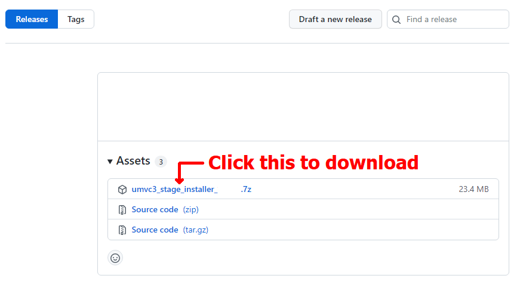

After unzipping the contents of the files, you will see these files:

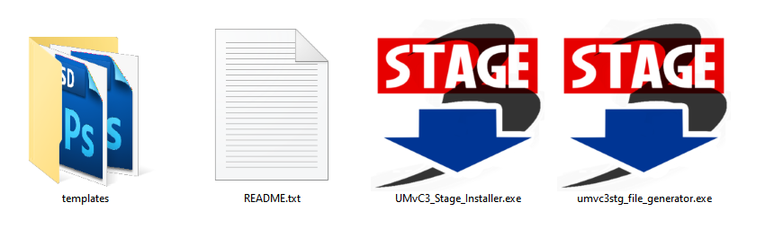

- `templates/`
- `README.txt` - this readme tells the users how to install the stage
- `UMvC3_Stage_Installer.exe` - this program will install the stage mod
- `umvc3stg_file_generator.exe` - this program is necessary only for the modder to generate a file for the installer to use

#

Create a folder for your stage mod, then copy `README.txt` and `UMvC3_Stage_Installer.exe` into that folder.

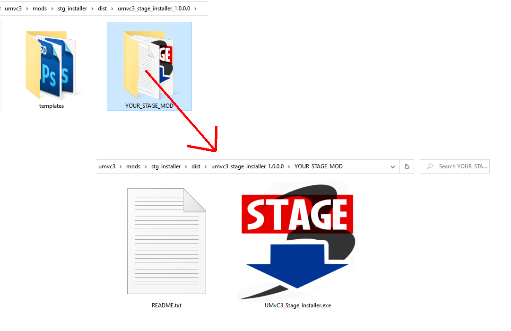

You will now need to include a `.umvc3stg` file in that folder, that is where `umvc3stg_file_generator.exe` comes in

- Run `umvc3stg_file_generator.exe`
- Locate your stage's arc file
- Click `Generate .umvc3stg`

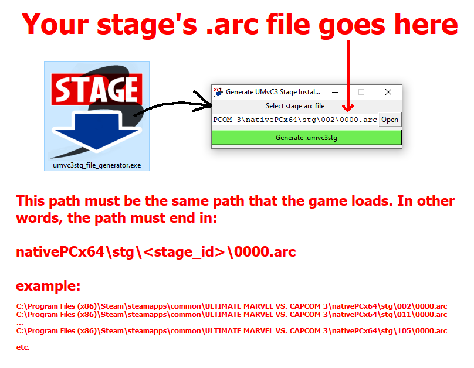

The `.umvc3stg` file will be generated in the same folder `umvc3stg_file_generator.exe` is in. **Do not** rename this file

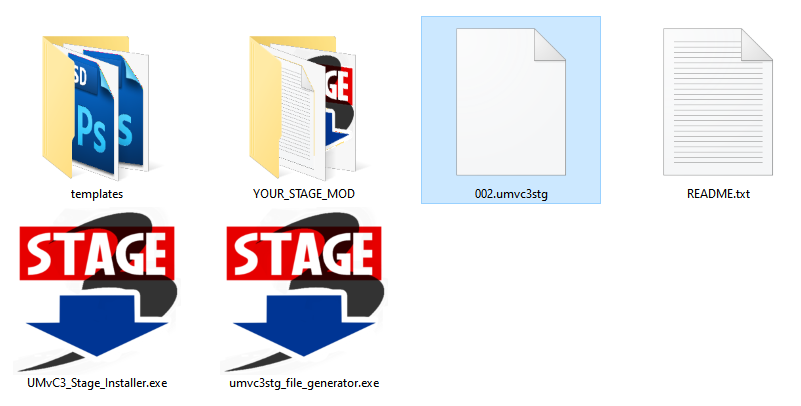

`.umvc3stg` files are simply zip files. You can open the generated `.umvc3stg` file in any zip program to observe its contents

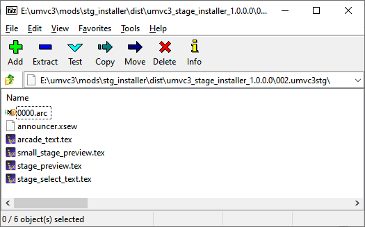

- 0000.arc - the stage itself
- announcer.xsew - the sound that plays when you select the stage
- arcade_text.tex - the text that appears on the bottom right between transitions in arcade mode
- small_stage_preview.tex - small thumbnail in the stage select carousel
- stage_preview.tex - large preview of the stage; shows up in win screen, stage select, and arcade mode transition
- stage_select_text.tex - the text that appears in the stage select screen

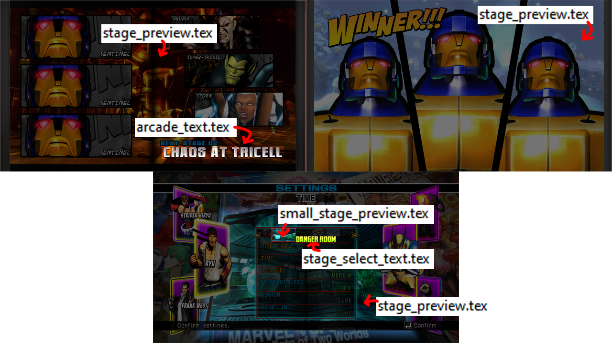

Now, if you want to change the stage preview(s), text, and announcer audio clip, you will need to replace the appropriate file(s) in the generated `.umvc3stg` file

## Stage Previews

To create the stage previews, use the templates provided

### stage_preview.psd

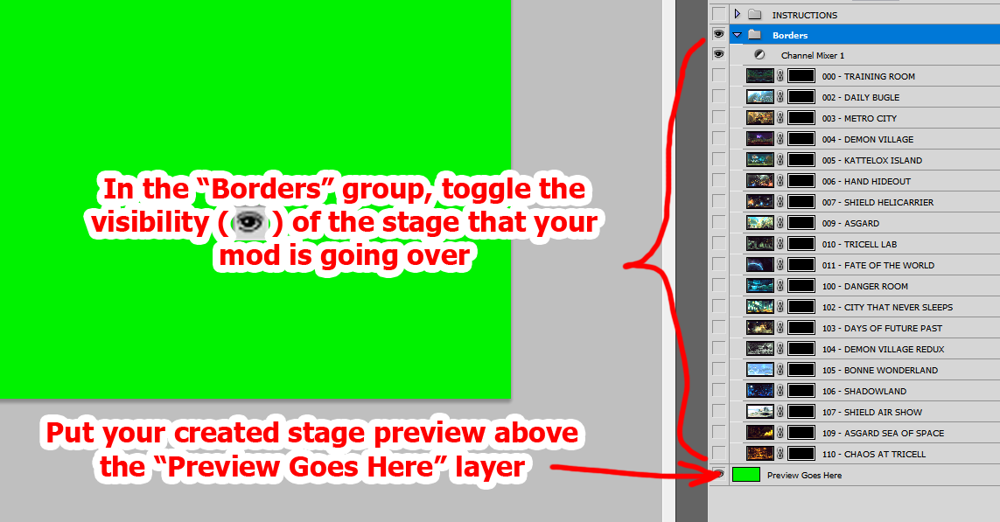

### small_stage_preview.psd

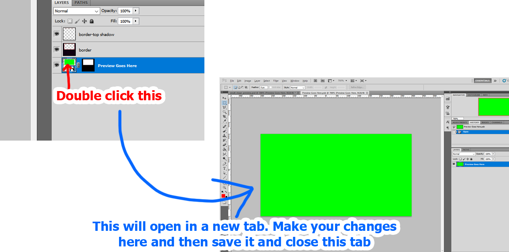

Save both of those as `stage_preview.dds` and `small_stage_preview.dds` respectively. You will need the [NVIDIA Texture Tools Exporter Photoshop plugin](https://developer.nvidia.com/nvidia-texture-tools-exporter) in order to save as `.dds`. They should both be saved as DXT5

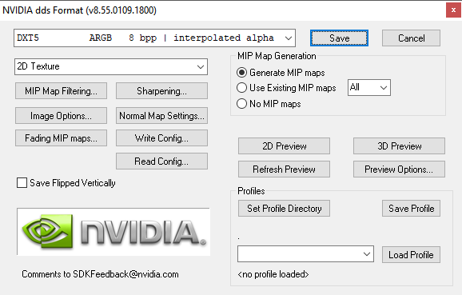

### Convert the .dds to .tex

One easy way to convert the previews to the correct file type (.tex) is to use the `ThreeWorkTool` https://github.com/EternalYoshi/ThreeWorkTool/releases/

- Open any random arc file in `ThreeWorkTool`

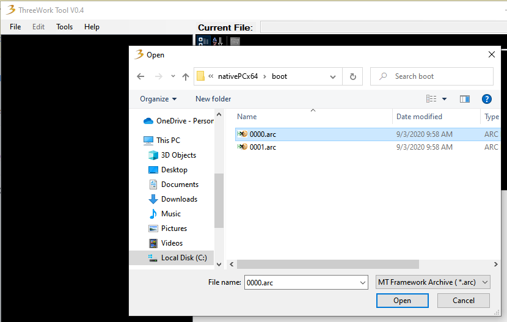

- Import `stage_preview.dds` and `small_stage_preview.dds` into any folder in the program

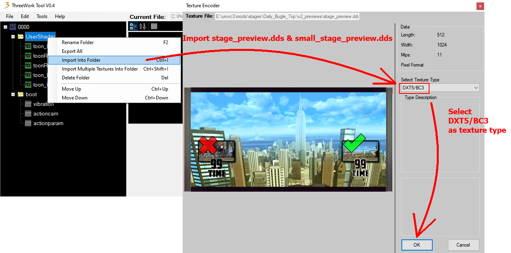

- Export the imported `stage_preview` and `small_stage_preview` as tex

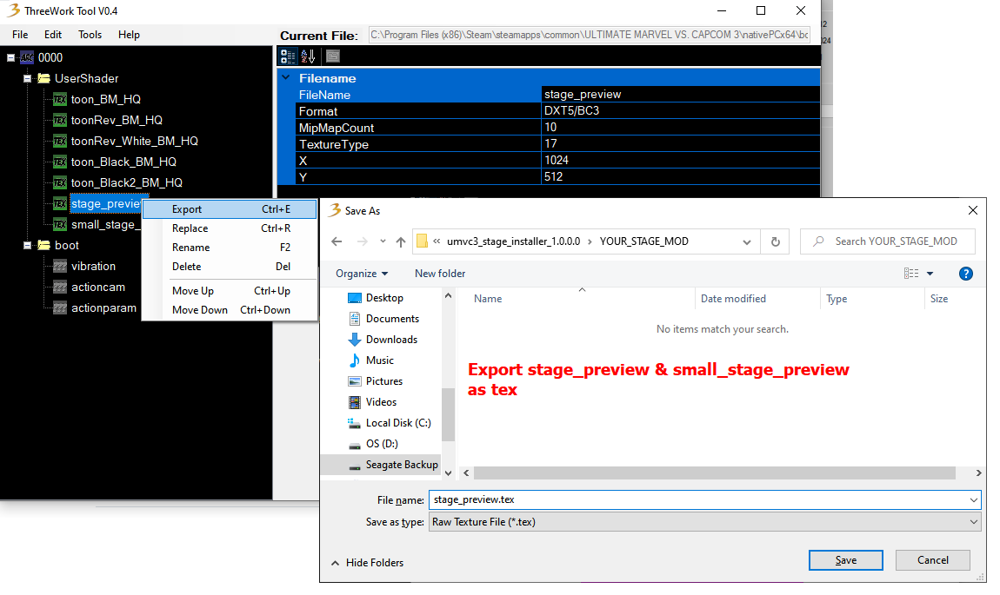

- Replace the preview .tex files with the ones you just created

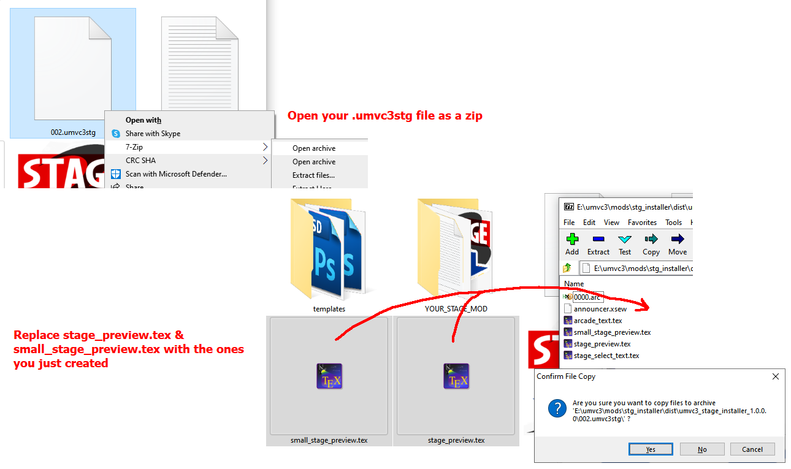

## Announcer Audio Clip

You can use a program like Audacity to create your announcer clip

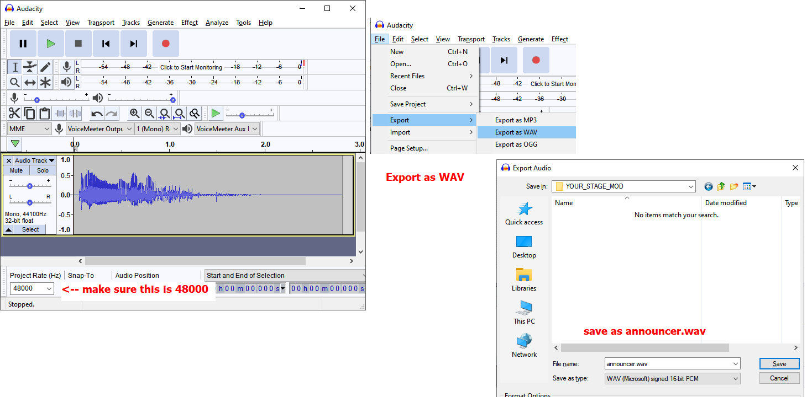

You have to convert the .wav file to a .xsew file. We can convert it with this [MT Framework Sound Tool](https://github.com/LuBuCake/MTF.SoundTool) https://raw.githubusercontent.com/LuBuCake/MTF.SoundTool/main/MTF.SoundTool/MTF.SoundTool.Versioning/MTF.SoundTool/latest.zip

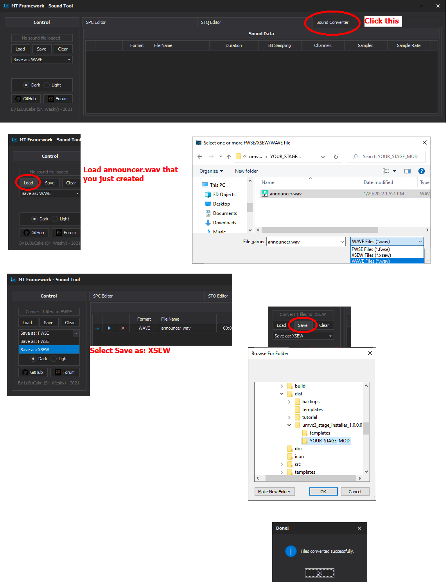

The generated .xsew file will not have the correct name, rename it `announcer.xsew`. Then just like with the stage previews, replace the file in the .umvc3stg with the one you just created

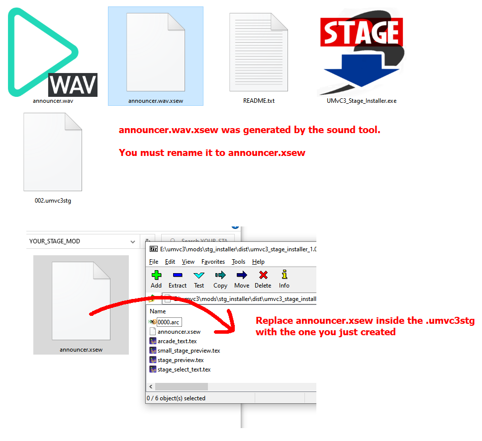

## Stage Text

Edit and replace `arcade_text.tex` and `stage_select_text.tex` in .umvc3stg for the stage name text in arcade transitions and the stage select. This is straight forward, so I will not provide a guide for this.

## Package for upload

Include the modified .umvc3stg file, UMvC3_Stage_Installer.exe, and README.txt in the same folder. Then zip that folder and you can upload the zip file to the mod hosting site of your choice

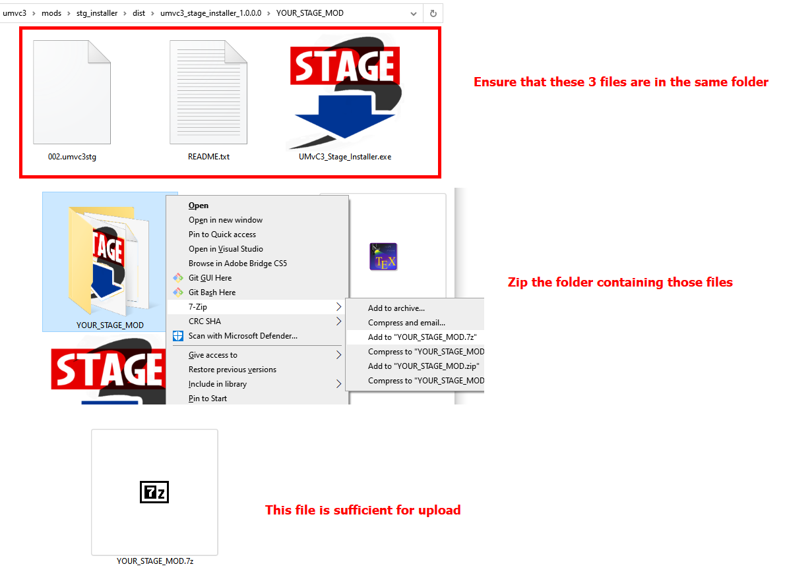

#
#
#
#
#
#
#
#
# Development
## Requirements
- Python 3.7+
- PyInstaller 4.1

`UMvC3_Stage_Installer.exe` code resides in `installer.pyw`

`umvc3stg_file_generator.exe` code resides in `umvc3stg_generator.pyw`

After making changes, run `build.bat`
